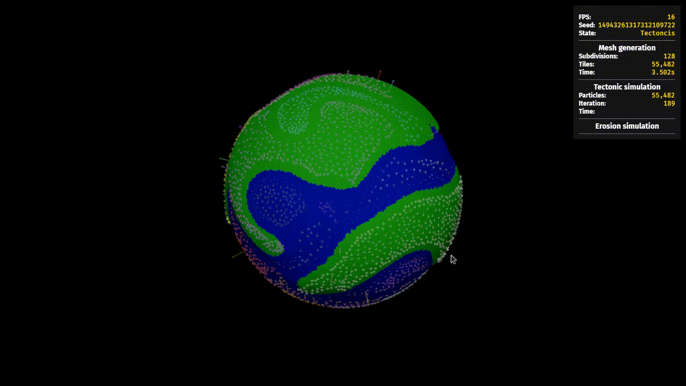

I am currently implementing the tectonic plate simulation, which will form the initial continents and mountain ranges used in the following hydraulic erosion step. 

Initial attempts used simple fluid simulation, where particles would be attracted to particles of the same plate and repulsed by particles of other plates. This did not work as well as I wished, with the tectonic plates acting fully like a liqoud they did not hold a rigid shape and would overlap.

The current attempt is using a Soft Body simulation implemented with the [Mass-spring-damper model](https://en.wikipedia.org/wiki/Mass-spring-damper_model).

I've now converted the existing code to use soft body shapes and added the spring and dampener logic, but the collision between soft bodies is missing, as well as the "frame" logic that tries to restore soft body shapes to the original shape.

The below gif is from the previous version based on fluid simlation, the new mass spring damper model is not fully implemented.

